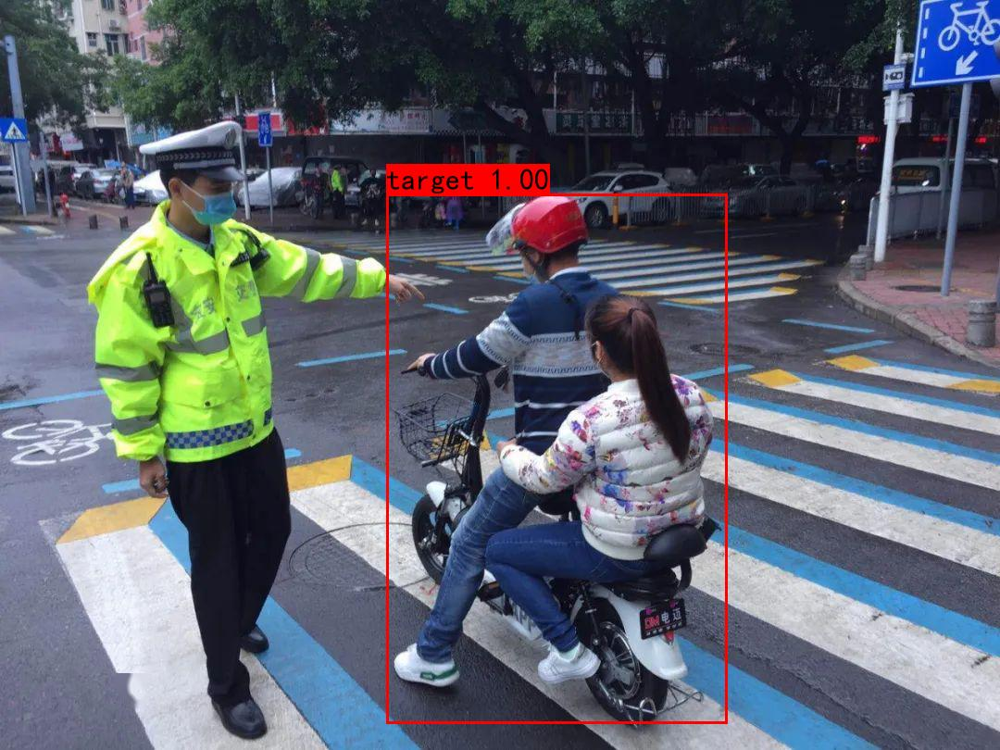
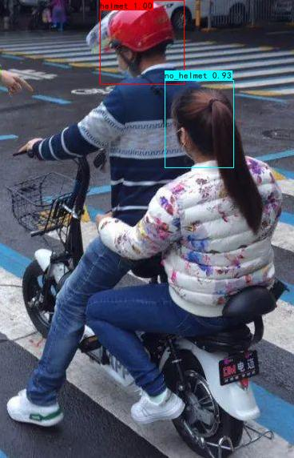

# 电动车头盔检测

本项目是基于SSD算法实现的电动车头盔检测。完整的项目是**基于SSD的改进-->知识蒸馏-->自蒸馏-->剪枝-->trt推理**。本想用来发论文的，但可能没那时间和精力了，这里仅选择项目中的一**部分内容**进行开源。我这里附上我论文中的效果图：【项目代码中提供的权重并不是最优权重，**最优权重暂不公开**】

## 开源说明

本项目是开源项目，近期发现有些人拿我的其他项目去发布收费资源，这种情况是**不允许**的，我希望我发布的开源项目是帮助大家学习交流的。后期再发现有拿我开源项目进行收费的我将举报，同时未来本人将考虑关闭所有开源项目。

另：如想用本项目发表论文或者毕设等，均需经过本人同意并且有偿或挂名，否则将会举报！

联系方式：wechat:y24065939s

E-mail:15930920977@163.com

CSDN:https://blog.csdn.net/z240626191s/article/details/131275527?spm=1001.2014.3001.5502





# 代码参数说明

```
--model:目标检测模型选择，现只支持SSD

--cuda:是否使用GPU，默认为True

--output:一些功能需要指定的输出路径

--conf_thres:置信度阈值，默认0.6

--iou_thres:iou阈值，默认0.5

--target_weights:第一次(人与电动车整体)权重路径

--helmet_weights:第二次(只对头部)权重路径

--fps:测试FPS，默认False
```

```
剪枝部分参数：

--pruning_model:是否对模型进行剪枝操作，默认为False(具体剪枝哪里需要自己去代码中修改)

--pruning_weights:即需要对哪个权重进行剪枝，需要填写路径(剪枝的权重必须包含图结构和权重)
```

```
预测部分

--predict:进行预测，将两次预测的结果在一个画面显示，默认False

--predict_2windows ：预测，两次预测的结果分窗口显示，默认False，暂不支持trt显示

--predict_single:预测，只单独对一个类进行预测，默认False（需要手动去改一下需要类别文件classes_path的txt文件，还有对应的权重路径）

--video:是否检测视频，默认False

--video_path:如果检测视频，输入视频路径，默认本文件下的6.mp4

--image:是否预测图像，默认False,开启功能以后在终端处输入图像路径(单图像检测)

--mAP:是否需要测试mAP，可以用--target_weights指定权重路径
```

```
训练部分:

--train：是否训练，默认False

--is_fine:是否微调训练，默认False

--pruned_model_path:预权重(已经剪枝后的模型)，默认model_data/pruning_model.pth

--batch_size:batch_size大小，默认4，根据自己显卡内存调节

--Init_Epoch：初始训练epoch，默认0

--Freeze_Epoch：冻结网络训练的epoch，默认50

--Freeze_lr:冻结训练学习率，默认5e-4，冻结训练学习率大一些，有助于网络的快速收敛

--UnFreeze_lr:解冻训练学习率，默认1e-4，解冻训练学习率小一些，有助于网络微调，更好的找到最优解

--UnFeeze_epoch：解冻训练总的epoch,默认100【50-100epoch为解冻训练】
```


# 预测

## 两个检测结果在同一画面显示

```shell
python helmet_dectection.py --predict --video --video_path 【your video path】  --target_weights pruned_trt_ckpt/ssd_target_512.engine --helmet_weights pruned_trt_ckpt/ssd_helmet_512.engine --trt
```

如果在target_weights,helmet_weights,video_path**默认**自己**填写**了需要检测的参数，可以直接输入

```
python helmet_dectection.py --predict --video
```

如果是预测图片,输入下面命令，程序运行后，在终端窗口输入图像路径

```
python helmet_dectection.py --predict --image
```


## 两个检测结果分窗口显示

```shell
python helmet_dectection.py --predict_2windows --video --video_path [视频路径] --target_weights model_data/target_512.pth --helmet_weights EC/model_data/helmet_512.pth --input_shape 512 --input_shape2 512
```

同理，如果你已经写了默认参数,只需要输入

```
python helmet_dectection.py --predict_2windows --video
```

图像的预测：

```
python helmet_dectection.py --predict_2windows --image
```

## 单目标检测

```shell
python helmet_dectection.py --predict_single --video --video_path [视频路径] --trt
```

上述命令默认是检测人与电动车整体，如果需要其他类手动修改tools/SSD_one_object.py中的classes_path，改成自己的类的文件，然后输入

```shell
python helmet_dectection.py --predict_single --video --target_weights pruned_trt_ckpt/ssd_target_512.engine
```

图像检测只需要把video换成image即可。

上面所有检测conf和iou阈值都是用的默认值，如果需要改变，在后面加上--conf_thres 参数 和--iou_thres 参数即可

------

# 剪枝

输入以下命令：

```
python helmet_dectection.py --pruning_model --pruning_weights 你需要剪枝的权重  --output 剪枝以后的权重保存在哪里
```

比如：

```
python helmet_dectection.py --pruning_model --pruning_weights=model_data/whole_model.pth  --output=model_data/
```

出现以下信息说明剪枝成功，剪枝后的模型将保存在model_data文件下，名字为pruning_model.pth，**如果需要修改保存后权重名字和剪枝细节，去tools/Model_Pruning.py中修改**

```
[ <DEP: prune_conv => prune_conv on vgg.24 (Conv2d(512, 512, kernel_size=(3, 3), stride=(1, 1), padding=(1, 1)))>, Index=[1, 2, 3, 5, 8, 10, 11, 13, 17, 18, 20, 25, 28, 29, 34, 36, 38, 40
, 44, 46, 50, 53, 58, 59, 60, 63, 65, 66, 68, 69, 74, 76, 81, 82, 83, 85, 87, 91, 95, 96, 97, 99, 101, 103, 109, 113, 115, 117, 119, 123, 124, 131, 132, 133, 134, 138, 139, 141, 143, 145,
 146, 147, 148, 150, 155, 158, 162, 163, 166, 173, 175, 176, 177, 179, 182, 187, 194, 195, 198, 199, 200, 201, 203, 205, 208, 212, 217, 221, 225, 228, 229, 235, 237, 240, 245, 248, 250, 2
52, 253, 255, 256, 260, 265, 267, 269, 270, 271, 273, 275, 277, 278, 280, 282, 284, 286, 287, 288, 289, 293, 294, 296, 302, 307, 308, 309, 312, 313, 317, 320, 323, 325, 330, 337, 339, 341
, 347, 349, 350, 353, 356, 359, 361, 362, 364, 365, 370, 371, 372, 379, 381, 382, 383, 384, 385, 387, 388, 396, 400, 406, 415, 418, 423, 426, 427, 431, 432, 436, 437, 438, 439, 440, 441,
442, 444, 447, 450, 452, 453, 457, 458, 459, 460, 462, 464, 465, 466, 468, 472, 475, 482, 484, 485, 486, 487, 490, 491, 494, 495, 496, 499, 502, 503, 507, 511], NumPruned=940236]

```

------

# 训练

## 训练自己的数据集

1.如果想训练自己的数据集。将数据集图片放在VOCdevkit/VOC2007/JPEGImages/下，xml标签放在VOCdevkit/VOC2007/Annotations/下。然后运行voc2ssd.py。

2.然后修改voc_annotation.py中的classes并运行。

3.运行下面代码：

```shell
python helmet_dectection.py --train --target_weights 权重路径
```


## 剪枝后进行模型的微调训练

```
python helmet_dectection.py --train --is_fine --pruned_model_path 你剪枝后的权重路径
```

比如：

```
python helmet_dectection.py --train --is_fine --pruned_model_path model_data/pruning_model.pth 
```

【注意：上述命令batchsize，学习率，冻结网络训练的epoch都采用默认值，需要更改直接传参就可以】

训练的时候，需要根据自己的类，去utils/config.py中修改参数，主要修改类别数，类别数量为自己的类的数+1(含有背景类)，比如自己的数据集是20个类，那么num_classes=21，也可以修改min_dim【SSD支持分辨率为300和512，如果修改了分辨率，feature_map也需要修改】

# FPS测试

```
python helmet_dectection.py --fps
```

因为FPS测试代码是继承了tools/ssd.py中的SSD类，如果需要预测自己的类，需要注意以下ssd.py中classes_path路径中要写自己的类，同时注意传入的权重，比如输入以下命令【前提已经将classes_path写为自己的类】

```
python helmet_dectection.py --fps --target_weights 权重路径
```

# mAP测试

mAP测试也是继承了tools/ssd.py，classes_path修改为自己的类，然后输入：

```
python helmet_dectection.py --mAP --target_weights=权重路径 --conf_thres 0.5 --iou_thres 0.5
```

会在当前目录中生成results文件，里面有mAP结果和F1值，P值和Recall

报错记录：

 

```
File "E:\graduate\student_pruning\nets_student\ssd_student_layers.py", line 47, in forward
    conf_preds = conf_data.view(num, num_priors, self.num_classes).transpose(2, 1)
RuntimeError: shape '[1, 24656, 2]' is invalid for input of size 73968

解决：测试mAP的时候报上述错误，需要检查tools/ssd.py中的classes_path中的txt是否修改为对应的类
```


以下报错是由于指定的shape和uitls/config shape不一致  17464是8732*num_classes。300 * 300的先验框数量是8732，512 * 512是24656

```
  File "E:\graduate\student_pruning\nets_student\ssd_student_layers.py", line 47, in forward
    conf_preds = conf_data.view(num, num_priors, self.num_classes).transpose(2, 1)
RuntimeError: shape '[1, 24656, 2]' is invalid for input of size 17464

```


# torch2onnx

修改torch2onnx.py中的ckpt_path，样例x的输入大小即可生成onnx权重

注意：由于本部分代码是使用蒸馏后的网络，因此有个del操作删除不需要的层，如果想使用最原始的网络，用net_student/ssd_student.py即可。

# onnx2engine[tensorRT推理]

修改onnx2trt.py的权重路径再运行即可生成对应的engine。有关详细的tensorrt推理教程看我另一篇文章：

https://blog.csdn.net/z240626191s/article/details/127529298?spm=1001.2014.3001.5501


# 权重链接：

链接：https://pan.baidu.com/s/1mBEi5PJl7ibfwzJ8PBrAqQ 
提取码：yypn

# 报错

报错1：

```
conf_preds = conf_data.view(num, num_priors, self.num_classes).transpose(2, 1)
RuntimeError: shape '[1, 24656, 2]' is invalid for input of size 17464
```

在SSD中，共有6个预测特征层。每个特征层分配的先验框数量分别为：4，6，6，6，4，4

以输入大小为：300×300为例，共有先验框38×38×4+19×19×6+10×10×6+5×5×6+3×3×4+1×1×4=8732个先验框

如果是输入大小为512×512，共有先验框64×64×4+32×32×6+16×16×6+8×8×6+4×4×4+2×2×4=24656个先验框

因此上面的错误是输入大小和真正的模型输入大小不匹配，需要检查输入大小
